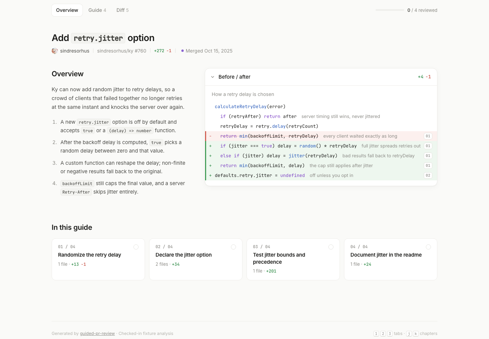
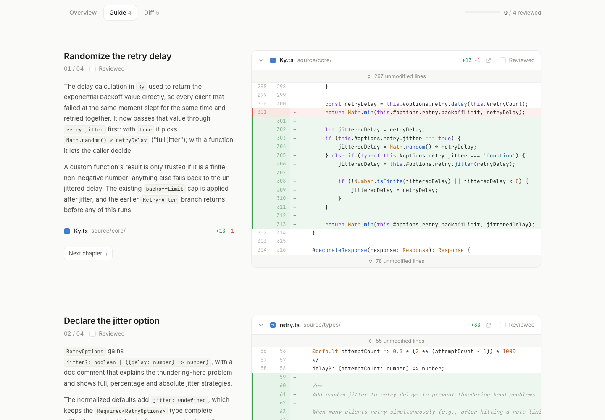
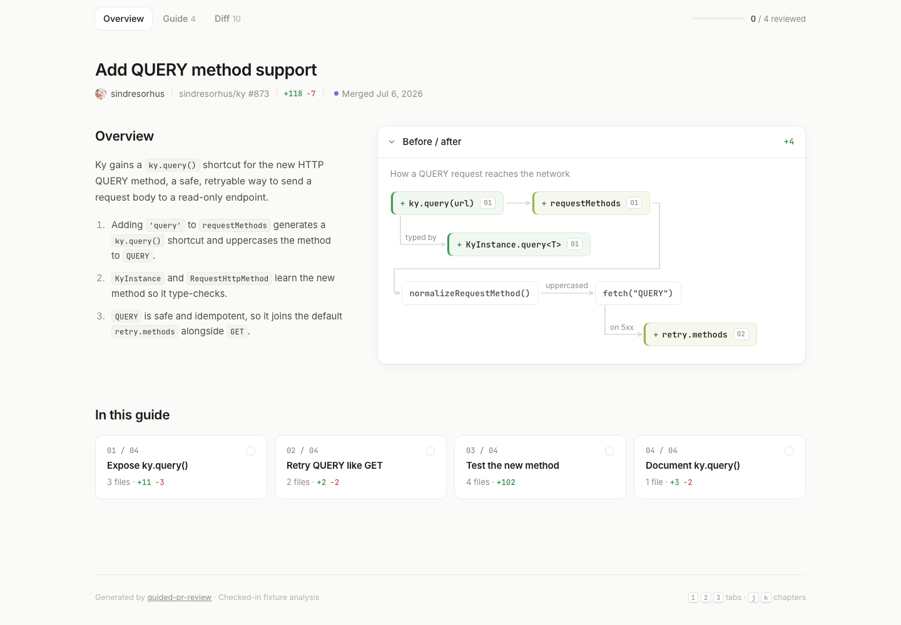

# guided-pr-review

Turn any GitHub pull request into a **guided walkthrough**: an Overview that shows the change before and after, a Guide that walks through the files one idea at a time, and a Diff. You get one self-contained HTML file you can open, share or keep offline.

**Live samples:**
[ky#760 · annotated before/after](https://chasemc67.github.io/guided-pr-review/samples/ky-760-walkthrough.html) ·
[ky#873 · flow-diagram before/after](https://chasemc67.github.io/guided-pr-review/samples/ky-873-walkthrough.html)
(source: [`samples/`](samples/))



<table><tr>
<td></td>
<td></td>
</tr></table>

> **Inspired by [Capy](https://capy.ai) 0.4.4 "Guided Reviews"** ([changelog](https://capy.ai/changelog/0.4.4)). This is an independent, open project that recreates the *reading experience* from Capy's public screenshots and demo. It is not affiliated with Capy and contains no Capy code. Anything not visible in Capy's public material is our own design and is marked **(ours)** below.

---

## Why

A big diff is shown in file order, so reviewers spend the first stretch of a review jumping between files to work out what the PR does. This tool does that work up front:

- **Overview**: one sentence of context, the numbered steps the PR takes, and a small **Before / after** "show me" view (an annotated mini-diff or a flow diagram), tagged with the chapters that implement each part.
- **Guide**: files are grouped into **chapters** (`01 / 04` …), each explained in plain words, with that chapter's files and their real diffs side by side. Check off **Reviewed** as you go.
- **Diff**: the classic list (`Files N`, two columns) and every diff, in a sensible order.
- **Ordering**: the core change comes first. Database, tests, docs and generated files come last.

## Install

Requirements: **Node 18.17+** and the **GitHub CLI 2.48.0+** ([`gh`](https://cli.github.com/)) logged in (`gh auth login`) or a `GH_TOKEN`. There are no npm dependencies.

```bash
git clone https://github.com/chasemc67/guided-pr-review.git
cd guided-pr-review
cp .env.example .env        # then paste your AI Gateway key (optional)
node scripts/cli.mjs --help
```

Optionally link it globally: `npm link`, then `guided-pr-review …` works from anywhere.

### As an agent skill (GitHub Copilot, Cursor, Claude Code, etc.)

The repo is a ready-made skill folder; [`SKILL.md`](SKILL.md) tells the agent when and how to use it. Copy or clone it into your skills directory, for example:

#### GitHub Copilot: native plugin install

Add the repository as a marketplace, then install the skill and interactive
canvas:

```bash
copilot plugin marketplace add heyitsaamir/guided-pr-review
copilot plugin install guided-pr-review@guided-pr-review
```

Start a new Copilot session after installing. Update later with:

```bash
copilot plugin update guided-pr-review
```

Direct repository installation also works:

```bash
copilot plugin install heyitsaamir/guided-pr-review
```

#### Legacy installer

```bash
curl -fsSL https://raw.githubusercontent.com/heyitsaamir/guided-pr-review/main/install-copilot.sh | sh
```

This remains available for Copilot versions without plugin support. Run the
same command later to update. It installs both the user-level skill and the
interactive canvas extension under `~/.copilot` (or `$COPILOT_HOME`).

#### Manual install and other agents

```bash
# GitHub Copilot (user-level)
git clone https://github.com/heyitsaamir/guided-pr-review.git ~/.copilot/skills/guided-pr-review
mkdir -p ~/.copilot/extensions
cp -R ~/.copilot/skills/guided-pr-review/extensions/guided-pr-review-canvas ~/.copilot/extensions/
# Cursor (project-level)
git clone https://github.com/chasemc67/guided-pr-review.git .cursor/skills/guided-pr-review
# Claude Code (user-level)
git clone https://github.com/chasemc67/guided-pr-review.git ~/.claude/skills/guided-pr-review
```

Then ask GitHub Copilot:

> Use `/guided-pr-review` to walk me through `https://github.com/owner/repo/pull/123`.

The Copilot installation uses the active Copilot model for analysis and opens
an interactive canvas with the original Overview / Guide / Diff UI. Diff lines
include controls to ask Copilot a focused question or post an inline GitHub
review comment; the top bar can post a general PR comment.

## Usage

```bash
node scripts/cli.mjs https://github.com/sindresorhus/ky/pull/760
node scripts/cli.mjs sindresorhus/ky#760 --out ./reviews --open
node scripts/cli.mjs owner/repo#42 --no-ai            # heuristic guide, no model call
```

| Flag | What it does |
|---|---|
| `-o, --out <dir>` | Output directory (default `./guided-review`) |
| `-m, --model <id>` | AI Gateway model id (default below) |
| `--no-ai` | Skip the model and build a heuristic guide |
| `--analysis <file>` | Render from an existing analysis JSON (e.g. hand-edited) |
| `--pr-data <file>` | Use saved PR data instead of calling `gh` |
| `--prepare` | Fetch and save PR data for an agent to analyze, then exit |
| `--save-data` | Also write `<name>.pr.json` for offline re-rendering |
| `--name <base>` | Output file base name |
| `--no-context` | Don't fetch file contents (the "N unmodified lines" bars won't expand) |
| `--open` | Open the HTML when done |
| `-q, --quiet` | Print only the output path |

Outputs: `<name>-walkthrough.html` (the page) and `<name>.json` (the analysis).

To rebuild the checked-in samples: `npm run sample`.

### Environment

| Variable | Purpose |
|---|---|
| `AI_GATEWAY_API_KEY` | [Vercel AI Gateway](https://vercel.com/docs/ai-gateway) key. Enables AI chapters and prose. If it's missing, or the AI call fails, the CLI falls back to the heuristic guide, prints a warning to stderr, shows an amber banner on every tab, and records why in the analysis JSON's `generatedBy` (`mode`, `reason`, `model`). |
| `GUIDED_REVIEW_MODEL` | Override the default model. |
| `GH_TOKEN` | Optional. By default the `gh` CLI's own auth is used. |

`.env` in the working directory or the repo root is loaded automatically. Never commit it; it's in `.gitignore`.

When installed as a GitHub Copilot skill, no gateway key is needed. Copilot runs
`--prepare`, writes the analysis JSON itself, and passes it back with
`--analysis`; the gateway variables above only apply to direct standalone CLI
usage.

### Model

The default is **`anthropic/claude-sonnet-5.5`** via the gateway's OpenAI-compatible endpoint (`https://ai-gateway.vercel.sh/v1/chat/completions`). Any gateway model id works with `--model`, e.g. `openai/gpt-5` or `google/gemini-2.5-pro`. The request uses a strict JSON schema (`response_format: json_schema`). If a provider rejects that, the CLI retries with `json_object` and the schema in the prompt, validates the result, and asks once more if the output is malformed.

## How it works

```
gh api ──► fetch-pr.mjs ──► analyze.mjs ──────────────► render.mjs ──► walkthrough.html
            meta, files,     AI Gateway (strict JSON)     tabs, chapters,
            patches, head    or heuristic fallback,       diffs, before/after,
            file contents    then normalizeAnalysis()     inline CSS + JS
```

- **`scripts/fetch-pr.mjs`** uses `gh api` to get the PR, all changed files (paginated) and patches. It also fetches each file's content at the head commit so collapsed context can expand.
- **`scripts/analyze.mjs`** builds the prompt (file list with heuristic roles plus patches, budgeted and with lockfiles omitted) and calls the gateway. Then `normalizeAnalysis()` enforces invariants whatever the source: real `+/−` counts, every file in exactly one chapter, unknown paths dropped, orphans grouped into trailing chapters, lockfiles always marked `generated`, peripheral chapters moved last, and chapter tags renumbered.
- **`scripts/render.mjs`** (plus `scripts/lib/`) renders one HTML file with inline CSS and JS: a tiny built-in syntax highlighter, file-type icons, the flow-diagram layout, and Reviewed state saved in `localStorage`.

### Analysis schema

```jsonc
{
  "overviewSentence": "string",
  "steps": ["string"],                       // 2–5
  "beforeAfter": {
    "caption": "How a retry delay is chosen",
    "mode": "annotated_diff",                 // or "flow"
    "lines": [{ "kind": "add", "indent": 1, "code": "…", "note": "…", "chapter": 1 }],
    "nodes": [{ "id": "q", "label": "ky.query(url)", "change": "added", "chapter": 1, "branchOf": null, "edgeLabel": null }]
  },
  "chapters": [{ "title": "Randomize the retry delay", "paragraphs": ["…"], "files": ["source/core/Ky.ts"] }],
  "orderedFiles": [{ "path": "source/core/Ky.ts", "role": "core" }]
}
```

Use backticks in any prose field to get inline code pills.

## Capy inspiration: what matches, what's ours

Source material: Capy's [0.4.4 changelog](https://capy.ai/changelog/0.4.4) screenshot and a founding engineer's public demo video. Capy publishes no API, schema or code for Guided Reviews.

| Area | Capy (public) | This project |
|---|---|---|
| Tabs | `Overview · Guide · Diff`, pill tabs | Same. Tab counts are **(ours)**. |
| Overview content | Context sentence + numbered steps + Before/after | Same |
| Before/after | Annotated pseudo-diff with grey callouts and `01` chapter tags, *or* a flow diagram with `+` nodes and chapter tags | Both modes, chosen by the model. "Changed" (olive) vs "added" (green) node styles are **(ours)**. |
| Chapters | `01 / 06`, bold title, Reviewed checkbox, 1–2 paragraphs, file list with +/−, real diffs on the right, "N unmodified lines" | Same, and the unmodified lines actually expand. |
| File rows | Type icon, bold name, grey path, `+N −M` | Same (our own icon set) |
| Ordering | "Core change first; database, tests and generated files last" | Same rule, made explicit: core → supporting → database → tests → docs → generated **(ours)** |
| Diff tab | `Files N` two-column list | Same, plus all diffs stacked underneath **(ours)** |
| Where the Overview lives | Inside the Guide | Its own **Overview** tab (opens first). The Guide holds just the chapters. **(ours)** |
| "In this guide" chapter cards on the Overview | — | **(ours)** |
| Progress meter, Reviewed state saved locally, chapter check cascading to files, auto-advance | Per-chapter/per-file checkboxes only | **(ours)** |
| Keyboard shortcuts (`1`/`2`/`3`, `j`/`k`) | Unknown | **(ours)** |
| Heuristic no-AI mode, editable analysis JSON, offline single file | — | **(ours)** |
| Generation | Proprietary; models undisclosed | Vercel AI Gateway + a strict JSON schema **(ours)** |
| Trigger | Every Capy-reviewed PR, in-app | On demand, any PR you can read with `gh` |

## Samples

| PR | Mode | Files |
|---|---|---|
| [sindresorhus/ky#760](https://github.com/sindresorhus/ky/pull/760) "Add `retry.jitter` option" | annotated before/after | [`ky-760-walkthrough.html`](samples/ky-760-walkthrough.html), [`ky-760.json`](samples/ky-760.json), [`ky-760.pr.json`](samples/ky-760.pr.json) |
| [sindresorhus/ky#873](https://github.com/sindresorhus/ky/pull/873) "Add QUERY method support" | flow before/after | [`ky-873-walkthrough.html`](samples/ky-873-walkthrough.html), [`ky-873.json`](samples/ky-873.json), [`ky-873.pr.json`](samples/ky-873.pr.json) |

The sample analyses are **hand-written fixtures** in the exact schema the model returns. They were written while building this without a gateway key. The PR data in `*.pr.json` is real output from `fetch-pr.mjs`.

## License

MIT. Capy is a trademark of its owners and is referenced here only to credit the inspiration.
